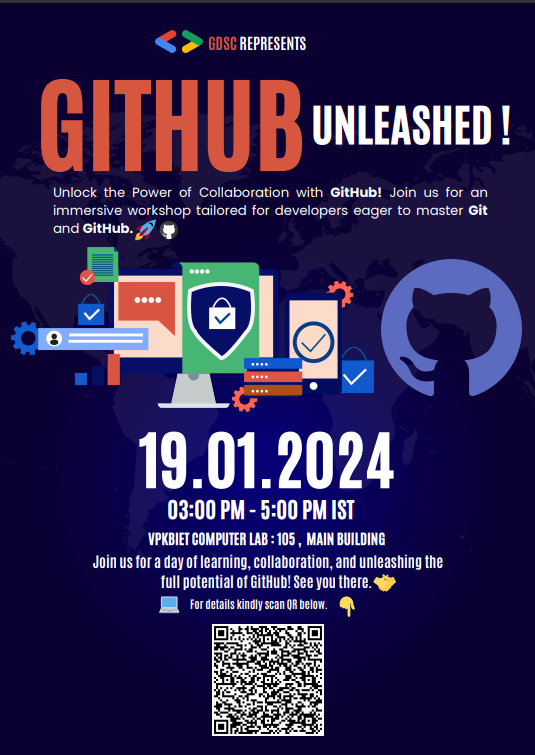

🚀 **Unlock the Power of Collaboration with GitHub! Join us for an immersive workshop tailored for developers eager to master Git and GitHub.** 🚀

**Date & Time: Friday 19 January 2024, 03:00 pm**

**Location: Computer Lab 105 Main Building**

**RSVP Link:** [RSVP Now](https://gdsc.community.dev/events/details/developer-student-clubs-vidya-pratishthans-kamalnayan-bajaj-institute-of-engineering-and-technology-baramati-presents-github-unleashed-a-hands-on-workshop-for-developers/)

👩‍💻 **What to Expect:**

**1. Introduction to Git:**

- Understand the fundamentals of version control.
- Learn how Git tracks changes and manages collaborative projects.

**2. GitHub Essentials:**

- Explore the core features of GitHub.
- Master repository creation, branching, and merging workflows.

**3. Collaboration Strategies:**

- Dive into collaborative development using Pull Requests.
- Gain insights into effective branch management for team projects.

**4. GitHub Actions:**

- Automate your workflow with GitHub Actions.
- Harness the power of continuous integration and deployment.

**5. Advanced Git Techniques:**

- Uncover tips and tricks for efficient version control.
- Navigate through complex project histories with ease.

**6. Open Source Contributions:**

- Learn the art of contributing to open source projects on GitHub.
- Understand the etiquette of submitting meaningful pull requests.

🛠️ **Hands-On Activities:**

- Participants will engage in real-world exercises to reinforce concepts.
- Work on a collaborative project to apply newly acquired skills.

🎓 **Who Should Attend:**

- Developers wanting to strengthen their version control skills.
- Teams looking to optimize their collaboration workflows.
- Anyone interested in open source contributions.

🔗 **How to Register:** [Fill the form](https://forms.gle/5ZvBHYPZT6sK4n9YA)

- Limited spots available, secure your spot now!

🎁 **Prerequisites:**

- Basic understanding of programming concepts.
- Familiarity with the command line is a plus but not mandatory.

📣 **Share your journey with #GitHubUnleashed!**

- Connect with fellow participants and share your progress.

🚨 **Important Note:**

- Make sure to bring your laptop for the hands-on activities.

🤝 **Join us for a day of learning, collaboration, and unleashing the full potential of GitHub! See you there!**
